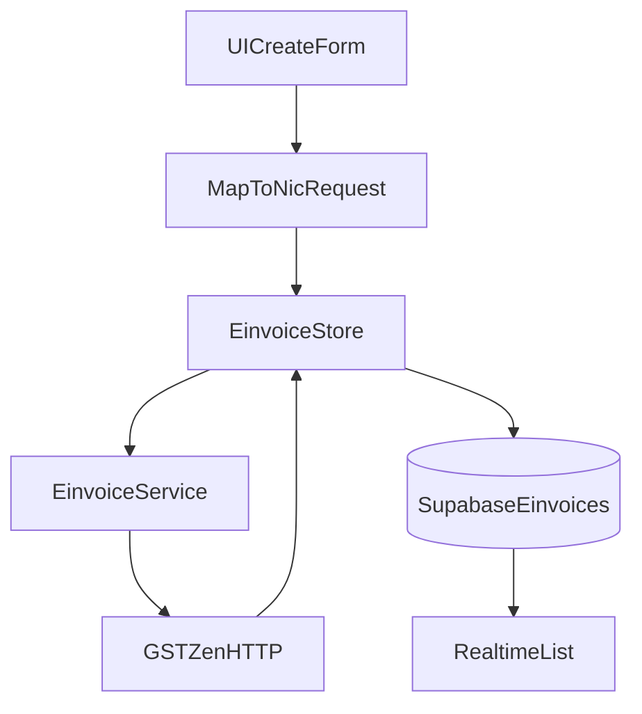

# E-Invoice module

This document describes how the Ramsoft Builder **e-invoice** feature works end to end: from invoice entry in Angular, through validation and NIC-aligned JSON, to the **GSTZen** HTTP API, **IRN** generation, and persistence in **Supabase**. It is written so another developer can implement or extend the module independently.

**Stack (this repository):** Angular 20, TypeScript, RxJS, Supabase (`@supabase/supabase-js`), Angular reactive forms, and a **custom signal-based store** (`EinvoiceStore`). The UI may use `angularx-qrcode` for IRN QR display.

---

## Table of contents

1. [Project overview](#1-project-overview)  
2. [Complete flow explanation](#2-complete-flow-explanation)  
3. [Folder structure](#3-folder-structure)  
4. [Supabase database design](#4-supabase-database-design)  
5. [Supabase integration](#5-supabase-integration)  
6. [API integration (GSTZen)](#6-api-integration-gstzen)  
7. [Store management (signals pattern)](#7-store-management-signals-pattern)  
8. [Interfaces and models](#8-interfaces-and-models)  
9. [Invoice creation process](#9-invoice-creation-process)  
10. [Validation rules](#10-validation-rules)  
11. [Error handling](#11-error-handling)  
12. [Success flow](#12-success-flow)  
13. [End-to-end flow diagram](#13-end-to-end-flow-diagram)  
14. [Environment variables](#14-environment-variables)  
15. [Implementation guide](#15-implementation-guide)  
16. [Example API request payload](#16-example-api-request-payload)  
17. [Example API responses](#17-example-api-responses)  
18. [Developer notes](#18-developer-notes)  
19. [Production recommendations](#19-production-recommendations)  
20. [Final result](#20-final-result)  

**Appendices:** [A. Optional enterprise tables](#appendix-a-optional-enterprise-tables) · [B. Glossary](#appendix-b-glossary)

---

## Appendix B: Glossary

| Term | Meaning |
| --- | --- |
| **GST e-invoice** | Structured B2B (and applicable) invoice reported in NIC JSON format to Invoice Registration Portal (IRP) via a GSP/ASP such as GSTZen. |
| **IRP** | Invoice Registration Portal (NIC ecosystem). |
| **GSP / ASP** | GST Suvidha Provider / Application Service Provider — e.g. GSTZen — that accepts JSON and talks to IRP on your behalf. |
| **IRN** | Invoice Reference Number — unique 64-char identifier returned on successful registration. |
| **Ack No. / Ack Dt** | Acknowledgement number and date from IRP. |
| **Signed QR Code** | Base64 (or similar) payload for the statutory QR; often rendered in the UI. |
| **NIC JSON** | Schema used for generate/cancel payloads (this codebase aligns types with NIC v1.1-style fields). |
| **RLS** | Row Level Security in Postgres/Supabase — policies restricting rows by `auth.uid()`. |

---

## 1. Project overview

### What this module does

The e-invoice module lets an authenticated user **compose an invoice** (seller, buyer, line items, taxes, optional e-way details), **submit** it to GSTZen’s generate endpoint, receive an **IRN** (or structured errors), **persist** the request and response in Supabase, and **list / view** invoices with realtime updates where configured.

### GST e-invoice workflow (conceptual)

1. Supplier prepares invoice data in **NIC JSON** format.  
2. Data is sent to a **GSP** (here: GSTZen), which forwards to **IRP**.  
3. IRP validates, registers the invoice, and returns **IRN**, acknowledgement fields, and **signed** invoice / QR data when successful.  
4. The supplier stores IRN on the invoice and uses the QR per regulations.

### IRN generation process (in this app)

1. UI collects data → mapped to `EinvoiceGenerateRequest`.  
2. `EinvoiceService.generateEinvoice` **POST**s JSON to `einvoiceGenUrl` with a **`Token`** header.  
3. `EinvoiceService` normalizes success: if **`Irn`** is present, the stream succeeds; otherwise it inspects **`Success`**, **`ErrorDetails`**, and message fields and throws `EinvoiceApiError` when the body indicates failure.  
4. On success, `EinvoiceStore` calls `EinvoicePersistenceService.saveGeneratedInvoice` to **insert** into `public.einvoices`.

### Response handling

Responses are typed as `EinvoiceGenerateResponse` (success fields + optional `Success`, `ErrorDetails`, `ErrorMessage`, `message`). See [einvoice.service.ts](data-access/einvoice/src/lib/einvoice.service.ts) (`assertGstZenBodySuccess`, `mapHttpError`) and [einvoice-nic.models.ts](data-access/einvoice/src/lib/models/einvoice-nic.models.ts).

---

## 2. Complete flow explanation

| Step | What happens | Where to look |
| --- | --- | --- |
| 1. User enters invoice details | Reactive form: parties, document, items, values, optional e-way. | [create-einvoice.page.ts](feature/create/src/lib/create-einvoice/create-einvoice.page.ts), templates under the same folder |
| 2. Form validation | Angular validators + business rules before submit. | Same page; [gstin.validators.ts](feature/create/src/lib/gstin.validators.ts) |
| 3. Payload creation | Form DTOs → `mapRamsoftFormToEinvoiceRequest` → `EinvoiceGenerateRequest`. | [create-einvoice-map-request.ts](feature/create/src/lib/create-einvoice-map-request.ts) |
| 4. API request | `HttpClient.post` with JSON body and headers. | [einvoice.service.ts](data-access/einvoice/src/lib/einvoice.service.ts) |
| 5. Response validation | IRN check; error aggregation from `ErrorDetails` / messages. | `assertGstZenBodySuccess` |
| 6. IRN generation | Successful body contains `Irn` (also accepts lowercase `irn` in raw JSON). | Same |
| 7. QR code handling | UI reads `SignedQRCode` (or equivalent) from stored `gstzen_response` / last response; QR component from `angularx-qrcode`. | View page templates; [package.json](../../package.json) |
| 8. Save invoice in Supabase | Insert into `einvoices` with `base_object`, `gstzen_response`, `sort_date_2`. | [einvoice-persistence.service.ts](data-access/einvoice/src/lib/einvoice-persistence.service.ts) |
| 9. Update invoice status | **Row-level:** status is derived from `gstzen_response` (e.g. `Irn`, `IrnStatus`, errors), not a separate `status` column in core migration. | [map-einvoice-doc-to-list-row.ts](feature/create/src/lib/create-einvoice/e-invoices-list/map-einvoice-doc-to-list-row.ts) |
| 10. Success handling | Store `status` → `success`; UI shows IRN / ack / QR. | [einvoice.store.ts](data-access/einvoice/src/lib/einvoice.store.ts) |
| 11. Error handling | Store `status` → `error`, `errorMessage` set; `EinvoiceApiError` carries HTTP or body details. | Same; [einvoice-api-error.ts](data-access/einvoice/src/lib/einvoice-api-error.ts) |

**SSR note:** `saveGeneratedInvoice` returns early when not in the browser (`isPlatformBrowser`), because the Supabase client is browser-only in this setup. Generation should run client-side after hydration, or you should move persistence to a server route if you need server-side saves.

---

## 3. Folder structure

### Reference layout (single Angular app)

Many teams colocate e-invoice code under the application tree:

```text
src/app/e-invoices/
├── pages/           # Routed screens (create, list, detail)
├── components/      # Smart + dumb UI building blocks
├── services/        # HTTP + domain services
├── stores/          # State (signals, NgRx, etc.)
├── interfaces/      # TS types for API/DTOs
├── models/          # Domain models / view models
├── utils/           # Pure helpers (format, map, math)
├── constants/       # Static config, labels, endpoints keys
├── guards/          # Route auth / feature flags
└── resolvers/       # Prefetch data before activate
```

**Purpose of each folder**

| Folder | Purpose |
| --- | --- |
| `pages` | Route entry components; orchestrate data load and child components. |
| `components` | Reusable UI; keep presentational pieces free of HTTP. |
| `services` | `HttpClient`, mapping, side effects; injectable singletons or scoped providers. |
| `stores` | Centralized UI/API state, loading and error flags. |
| `interfaces` / `models` | Type safety for NIC JSON, Supabase rows, and form shapes. |
| `utils` | Testable pure functions (totals, date format, sanitization). |
| `constants` | Magic strings and default URLs in one place (still prefer env for secrets). |
| `guards` / `resolvers` | Router integration for auth and data prefetch. |

### This monorepo (Nx + domain libraries)

This repo uses **path aliases** (`@ramsoft-builder/e-invoices/...`) and splits code by **type**:

| Reference folder | Ramsoft Builder location |
| --- | --- |
| `pages/` | [feature/create/src/lib/...](feature/create/src/lib/) (create, list, view routes) |
| `components/` | [ui/form/src/lib/...](ui/form/src/lib/) (presentational) + templates inside feature pages |
| `services/`, `stores/`, repositories | [data-access/einvoice/src/lib/](data-access/einvoice/src/lib/) (`EinvoiceService`, `EinvoiceStore`, `EinvoicePersistenceService`, `EinvoiceDocRepository`, …) |
| `interfaces/`, `models/` | [data-access/einvoice/src/lib/models/einvoice-nic.models.ts](data-access/einvoice/src/lib/models/einvoice-nic.models.ts), [create-einvoice-map-request.ts](feature/create/src/lib/create-einvoice-map-request.ts) |
| `utils/` | e.g. [sanitize-undefined-deep.ts](data-access/einvoice/src/lib/sanitize-undefined-deep.ts), [einvoice-doc-sort-key.ts](data-access/einvoice/src/lib/einvoice-doc-sort-key.ts) |
| `guards/`, `resolvers/` | App router in [apps/ramsoft-web/src/app](../../apps/ramsoft-web/src/app/) (extend under `libs/e-invoices/feature/...` if you add route-level data resolvers) |

---

## 4. Supabase database design

### Core table: `public.einvoices`

Defined in [supabase/migrations/20250512000000_ramsoft_core.sql](../../supabase/migrations/20250512000000_ramsoft_core.sql).

| Column | Type | Purpose |
| --- | --- | --- |
| `id` | `uuid` (PK, default `gen_random_uuid()`) | Primary key. |
| `user_id` | `uuid` (FK → `auth.users`) | Owner; RLS uses `auth.uid() = user_id`. |
| `base_object` | `jsonb` | NIC generate request as stored (sanitized). |
| `gstzen_response` | `jsonb` | Full GSTZen / IRP response (success or error-shaped). |
| `created_at` | `timestamptz` | Insert time. |
| `sort_date_2` | `bigint` | Client-supplied sort key (app uses `Date.now()` on save). |

Indexes: `einvoices_user_sort_idx` on `(user_id, sort_date_2 desc)`.

**RLS:** `select` / `insert` / `update` / `delete` policies require `auth.uid() = user_id`.

**Realtime:** Table is added to `supabase_realtime` publication for `postgres_changes`.

### Dashboard: `public.user_dashboard_fy`

Per-user financial-year counters (including invoice counts). See the same core migration.

### Cancellation archive: `public.cinvoices` + RPC

[supabase/migrations/20250512140000_cinvoices_cancel_rpc.sql](../../supabase/migrations/20250512140000_cinvoices_cancel_rpc.sql) defines:

- **`cinvoices`** — archived row after cancel: `source_einvoice_id`, `base_object`, `gstzen_response`, `gstzen_cancel_response`, `cancel_reason`, `fy_key`, etc.  
- **`archive_and_remove_einvoice(p_id, p_cancel_json, p_cancel_reason, p_fy_key)`** — security definer RPC: copies from `einvoices`, deletes original, optionally updates `user_dashboard_fy`.

### Status fields and JSON storage

There is **no** dedicated `invoice_status` enum column in the core `einvoices` table. Operational status for the UI is **derived** from `gstzen_response` (and sometimes legacy flat fields) in [map-einvoice-doc-to-list-row.ts](feature/create/src/lib/create-einvoice/e-invoices-list/map-einvoice-doc-to-list-row.ts) (e.g. `Irn`, `IrnStatus`, `Success`, `ErrorDetails`).

### Relationships (high level)

```text
auth.users (1) ──< (many) einvoices.user_id
auth.users (1) ──< (many) cinvoices.user_id
einvoices.id     ── referenced as cinvoices.source_einvoice_id (after archive)
```

---

## 5. Supabase integration

### Client setup

The browser Supabase client is provided by `provideSupabaseClient` and injected as `SUPABASE_CLIENT` (null on server). Implementation: [libs/shared/data-access/supabase/src/lib/supabase.client.ts](../../libs/shared/data-access/supabase/src/lib/supabase.client.ts).

### Environment configuration

Public URL and anon (or publishable) key are supplied from `apps/ramsoft-web/src/environments/environment*.ts` into `provideSupabaseClient(environment.supabase)`.

### Insert pattern (save after IRN)

Mirrors [einvoice-persistence.service.ts](data-access/einvoice/src/lib/einvoice-persistence.service.ts):

```typescript
const { error } = await supabase.from('einvoices').insert({
  user_id: userId,
  base_object: baseObjectJson,
  gstzen_response: gstZenResponseJson,
  sort_date_2: Date.now(),
});
if (error) throw error;
```

### Realtime handling

[EinvoiceDocRepository](data-access/einvoice/src/lib/repositories/einvoice-doc.repository.ts) loads the latest rows, then subscribes to `postgres_changes` on `public.einvoices` filtered by `user_id`, merging inserts/updates/deletes into an in-memory list exposed as an RxJS `Observable`.

### Error handling

- **Insert fails:** error propagates; `EinvoiceStore` sets `error` and message (and IRN may already exist at NIC — see [§11](#11-error-handling)).  
- **No client:** If `SUPABASE_CLIENT` is null (SSR / missing env), persistence is skipped; avoid silent “success” in product code by gating submit to browser or using a server proxy.

### GSTZen configuration (related)

GSTZen URL and token are **not** stored in Supabase; they are app runtime config (see [§6](#6-api-integration-gstzen) and [app.config.ts](../../apps/ramsoft-web/src/app/app.config.ts)).

**`app.config.ts` excerpt (conceptual):**

```typescript
import { provideSupabaseClient } from '@ramsoft-builder/shared/data-access/supabase';
import { GSTZEN_EINVOICE_CONFIG } from '@ramsoft-builder/e-invoices/data-access/einvoice';
import { environment } from '../environments/environment';

export const appConfig: ApplicationConfig = {
  providers: [
    ...provideSupabaseClient(environment.supabase),
    {
      provide: GSTZEN_EINVOICE_CONFIG,
      useValue: {
        einvoiceGenUrl: environment.gstZen.einvoiceGenUrl,
        einvoiceCancelUrl: environment.gstZen.einvoiceCancelUrl,
        token: environment.gstZen.token,
      },
    },
    provideHttpClient(withFetch()),
    // ...
  ],
};
```

---

## 6. API integration (GSTZen)

### Endpoint

**Generate (POST):**  
`https://my.gstzen.in/~gstzen/a/post-einvoice-data/einvoice-json/`

**Cancel (POST)** (used by `cancelEinvoice`):  
Default URL is defined in [gstzen-einvoice.config.ts](data-access/einvoice/src/lib/gstzen-einvoice.config.ts) as  
`https://my.gstzen.in/~gstzen/a/post-einvoice-data/einvoice-json/cancel/`  
(overridable via `einvoiceCancelUrl` in config).

### Service creation

Injectable: [EinvoiceService](data-access/einvoice/src/lib/einvoice.service.ts), `providedIn: 'root'`, injects `HttpClient` and `GSTZEN_EINVOICE_CONFIG`.

### HTTP POST, headers, authentication

- **Headers:** `Token: <gstZen.token>`, `Content-Type: application/json`.  
- **Body:** `EinvoiceGenerateRequest` JSON.  
- If `token` is missing/blank, the service returns `throwError` with `EinvoiceApiError` before calling HTTP.

**Illustrative snippet:**

```typescript
const headers = new HttpHeaders({
  Token: this.gstZen.token,
  'Content-Type': 'application/json',
});

return this.http
  .post<EinvoiceGenerateResponse>(this.gstZen.einvoiceGenUrl, body, { headers })
  .pipe(
    map((res) => this.assertGstZenBodySuccess(res)),
    catchError((err) => throwError(() => this.mapHttpError(err))),
  );
```

### Payload format

Root object matches NIC-style sections: `Version`, `TranDtls`, `DocDtls`, `SellerDtls`, `BuyerDtls`, `ItemList`, `ValDtls`, optional `EwbDtls`, etc. See [§16](#16-example-api-request-payload).

### Timeout and retry (recommended patterns)

**Current implementation:** no `timeout` or `retry` on the generate observable.

**Recommended** (add in the service or a thin wrapper):

```typescript
import { timeout, retry, catchError } from 'rxjs/operators';
import { throwError, timer } from 'rxjs';

this.http.post<EinvoiceGenerateResponse>(url, body, { headers }).pipe(
  timeout({ first: 60_000 }),
  retry({ count: 2, delay: () => timer(1_500) }),
  map((res) => this.assertGstZenBodySuccess(res)),
  catchError((err) => throwError(() => this.mapHttpError(err))),
);
```

Tune limits per GSTZen SLAs and UX; idempotency and duplicate IRN handling remain business concerns (retrying the **same** invoice may return a duplicate error from NIC).

---

## 7. Store management (signals pattern)

### Pattern in this repo

`EinvoiceStore` is an **`@Injectable` class** using Angular **`signal`** and **`computed`**. It is **not** `@ngrx/signals` `signalStore`. For larger teams you could port the same surface to NgRx SignalStore while keeping `EinvoiceService` / persistence unchanged.

### State

| Member | Type | Role |
| --- | --- | --- |
| `status` | `signal<'idle' \| 'loading' \| 'success' \| 'error'>` | UI loading / outcome. |
| `errorMessage` | `signal<string \| null>` | Last failure message. |
| `lastResponse` | `signal<EinvoiceGenerateResponse \| null>` | Last successful API body. |
| `lastIrn` | `computed` | `lastResponse()?.Irn?.trim() ?? null` |
| `lastAckNo` | `computed` | `lastResponse()?.AckNo ?? null` |

### Actions

- `reset()` — clears status, error, response.  
- `dismissSubmissionError()` — clears error state after a failed submit.  
- `createInvoice(request)` — guards concurrent loads, sets `loading`, awaits `generateEinvoice`, saves to Supabase when `authStore.user()?.id` exists, then `success` or `error`.

**Reference implementation:** [einvoice.store.ts](data-access/einvoice/src/lib/einvoice.store.ts).

---

## 8. Interfaces and models

### Request / response (NIC)

- **Request:** `EinvoiceGenerateRequest` and nested types (`TranDtls`, `DocDtls`, `SellerDtls`, `BuyerDtls`, `ItemListEntry`, `ValDtls`, `EwbDtls`, …) — [einvoice-nic.models.ts](data-access/einvoice/src/lib/models/einvoice-nic.models.ts).  
- **Response:** `EinvoiceGenerateResponse` extends success fields (`Irn`, `AckNo`, `SignedQRCode`, …) with optional `Success`, `ErrorDetails`, `ErrorMessage`, `message`.

### Form / mapping models

[create-einvoice-map-request.ts](feature/create/src/lib/create-einvoice-map-request.ts) defines form-facing types (`PartyForm`, `ItemForm`, `ValForm`, …) and `mapRamsoftFormToEinvoiceRequest` to build `EinvoiceGenerateRequest`.

### Supabase row shapes

Persistence uses snake_case columns; repositories map to a legacy-friendly document shape (`baseObject`, `gstzenResponse`) for UI consumption — see [einvoice-doc.repository.ts](data-access/einvoice/src/lib/repositories/einvoice-doc.repository.ts).

---

## 9. Invoice creation process

1. **Document identity:** `DocDtls.Typ`, `No`, `Dt` — date often formatted `DD/MM/YYYY` from ISO in the mapper.  
2. **Parties:** Seller/Buyer GSTIN, legal/trade name, address, PIN, state code (`Stcd`), place of supply (`Pos`) for buyer.  
3. **Line items:** `ItemList` entries with `HsnCd`, quantities, taxable values, `GstRt`, split of `IgstAmt` vs `CgstAmt`/`SgstAmt` per interstate vs intrastate rules.  
4. **Totals:** `ValDtls` — assessable value, tax totals, `RndOffAmt`, `TotInvVal`, discounts, other charges.  
5. **GST validations:** e.g. GSTIN pattern validators — [gstin.validators.ts](feature/create/src/lib/gstin.validators.ts).  
6. **State codes:** reference list — [indian-states.ts](feature/create/src/lib/indian-states.ts).  

The create page contains the full reactive form and calculation pipeline; treat the mapper and validators as the **contract** for payload shape.

---

## 10. Validation rules

| Area | Rule (typical) | Notes |
| --- | --- | --- |
| GSTIN | 15-char format, state code valid | Custom / pattern validators |
| Invoice date | Valid calendar date; not future beyond policy | NIC / portal rules evolve — confirm with GSTZen docs |
| State / POS | `Stcd` / `Pos` consistent with GSTIN prefix | Align with `indian-states` |
| HSN | Length and digits per policy; goods vs services (`IsServc`) | NIC item rules |
| Amounts | Line totals vs header `ValDtls`; tax rate vs split amounts | Reconcile before submit |
| Token | Non-empty `gstZen.token` before HTTP | Enforced in `EinvoiceService` |

---

## 11. Error handling

| Failure | Behavior |
| --- | --- |
| **API HTTP error** | `mapHttpError` builds `EinvoiceApiError` from `HttpErrorResponse`, preferring `ErrorDetails` / `message` / `ErrorMessage` from body. |
| **GSTZen 200 with business failure** | `assertGstZenBodySuccess` throws `EinvoiceApiError` when no IRN and `Success` / `ErrorDetails` / messages indicate failure. |
| **Missing token** | Immediate `EinvoiceApiError` (no network). |
| **Duplicate IRN / NIC conflicts** | Conveyed in `ErrorDetails` or message text; treat as non-retryable unless your flow uses a new document number. |
| **Network / CORS** | Surfaced as `EinvoiceApiError` or generic message; browser CORS may require a **backend proxy** for third-party APIs in some deployments. |
| **Supabase insert** | Native Supabase `error` thrown from persistence; store shows `error` — user may have IRN without row if you do not handle ordering (see [§19](#19-production-recommendations)). |

Custom error class: [einvoice-api-error.ts](data-access/einvoice/src/lib/einvoice-api-error.ts) (`status?`, `body?`).

---

## 12. Success flow

On success the API body typically includes:

- **`Irn`** — primary success indicator in this codebase.  
- **`AckNo`**, **`AckDt`** — acknowledgement.  
- **`SignedQRCode`** — for QR rendering.  
- **`SignedInvoice`** — signed payload per NIC/GSTZen.  
- **`Status`** — portal status string when present.

The UI updates from `EinvoiceStore.lastResponse` and/or from the row reread after insert. List rows derive human-readable status from `gstzen_response` (see mapper in [§2](#2-complete-flow-explanation)).

---

## 13. End-to-end flow diagram

### ASCII architecture

```text
UI Form (create-einvoice.page)
        ↓
mapRamsoftFormToEinvoiceRequest (create-einvoice-map-request)
        ↓
EinvoiceStore.createInvoice
        ↓
EinvoiceService.generateEinvoice  ──POST JSON + Token header──►  GSTZen API
        ↓
IRN / error in response body
        ↓
EinvoicePersistenceService.saveGeneratedInvoice  ──insert──►  Supabase public.einvoices
        ↓
EinvoiceDocRepository (postgres_changes)  ──►  List / realtime UI
        ↓
Success screen / IRN + QR display
```

### Mermaid (optional)



---

## 14. Environment variables

Configure in `apps/ramsoft-web/src/environments/environment.ts` (and `environment.prod.ts` for production). Types for GSTZen: [gstzen-environment.ts](../../apps/ramsoft-web/src/environments/gstzen-environment.ts).

| Variable / key | Purpose |
| --- | --- |
| `supabase.url` | Supabase project URL |
| `supabase.anonKey` | Public anon or publishable key (RLS still applies) |
| `gstZen.einvoiceGenUrl` | Full POST URL for generate |
| `gstZen.einvoiceCancelUrl` | Optional override for cancel endpoint |
| `gstZen.token` | GSTZen **`Token`** header value |

**Security:** Do **not** commit production tokens to git. Prefer CI/CD secrets, `.env` not checked in, or a **server-side proxy** that attaches the token. Replace any real values in local files before sharing or publishing the repo. This README uses **placeholders only**.

Example shape (placeholders):

```typescript
export const environment = {
  production: false,
  supabase: {
    url: 'https://YOUR_PROJECT_REF.supabase.co',
    anonKey: 'YOUR_SUPABASE_ANON_OR_PUBLISHABLE_KEY',
  },
  gstZen: {
    einvoiceGenUrl:
      'https://my.gstzen.in/~gstzen/a/post-einvoice-data/einvoice-json/',
    einvoiceCancelUrl: undefined,
    token: 'YOUR_GSTZEN_API_TOKEN',
  },
};
```

---

## 15. Implementation guide

1. **Install dependencies** (from repo root): `pnpm install`  
2. **Configure environment** as in [§14](#14-environment-variables).  
3. **Apply Supabase migrations:** e.g. `supabase db push` or run SQL from `supabase/migrations/` in order in the Supabase SQL editor.  
4. **Wire providers** in `app.config.ts`: `provideSupabaseClient`, `GSTZEN_EINVOICE_CONFIG`, `provideHttpClient`.  
5. **Routes:** E-invoice routes are exported from the feature library and composed in the app router — see [create-einvoice.routes.ts](feature/create/src/lib/create-einvoice.routes.ts) and [apps/ramsoft-web/src/app/app.routes.ts](../../apps/ramsoft-web/src/app/app.routes.ts).  
6. **Run the app:** `npm run web:dev` (serves `ramsoft-web` on port 4200 per [package.json](../../package.json)).  
7. **Verify:** Sign in → create invoice → confirm IRN → row in `einvoices` → list updates (realtime if enabled).  
8. **Quality gates:** `nx build ramsoft-web`, `nx lint ramsoft-web` (and library targets as you add them).

---

## 16. Example API request payload

Minimal illustrative NIC-style JSON (field names as used by types in this repo). Adjust mandatory fields per current NIC/GSTZen documentation.

```json
{
  "Version": "1.1",
  "TranDtls": {
    "TaxSch": "GST",
    "SupTyp": "B2B",
    "RegRev": "N",
    "IgstOnIntra": "N"
  },
  "DocDtls": {
    "Typ": "INV",
    "No": "INV-1001",
    "Dt": "12/05/2026"
  },
  "SellerDtls": {
    "Gstin": "29AAAAA0000A1Z5",
    "LglNm": "Example Seller Pvt Ltd",
    "Addr1": "1 MG Road",
    "Loc": "Bengaluru",
    "Pin": 560001,
    "Stcd": "29"
  },
  "BuyerDtls": {
    "Gstin": "27BBBBB0000B1Z5",
    "LglNm": "Example Buyer LLP",
    "Pos": "27",
    "Addr1": "221B Baker Street",
    "Loc": "Mumbai",
    "Pin": 400001,
    "Stcd": "27"
  },
  "ItemList": [
    {
      "SlNo": "1",
      "IsServc": "N",
      "PrdDesc": "Sample goods",
      "HsnCd": "10063090",
      "Qty": 10,
      "Unit": "KGS",
      "UnitPrice": 100,
      "TotAmt": 1000,
      "AssAmt": 1000,
      "GstRt": 5,
      "IgstAmt": 50,
      "CgstAmt": 0,
      "SgstAmt": 0,
      "TotItemVal": 1050
    }
  ],
  "ValDtls": {
    "AssVal": 1000,
    "IgstVal": 50,
    "CgstVal": 0,
    "SgstVal": 0,
    "TotInvVal": 1050
  }
}
```

---

## 17. Example API responses

### Success (illustrative)

```json
{
  "Success": "Y",
  "Irn": "abc123...64chars-total-example-irn-value-here-xxxxxxxx",
  "AckNo": "123456789012345",
  "AckDt": "12/05/2026 15:04:00",
  "SignedInvoice": "<base64-or-signed-payload-string>",
  "SignedQRCode": "<base64-qr-string>",
  "Status": "ACT"
}
```

### Error (illustrative)

```json
{
  "Success": "N",
  "ErrorDetails": [
    {
      "ErrorCode": "2150",
      "ErrorMessage": "Duplicate Invoice Reference Number"
    }
  ],
  "ErrorMessage": "Duplicate Invoice Reference Number"
}
```

Actual shapes may include lowercase keys or extra fields; the service tolerates some variation (e.g. `irn` vs `Irn`).

---

## 18. Developer notes

- **Token missing:** Generate call fails fast with a clear `EinvoiceApiError`.  
- **CORS:** Direct browser calls to `my.gstzen.in` depend on GSTZen CORS policy; if blocked, route traffic through your **backend** proxy.  
- **RLS:** Inserts must use the authenticated user’s JWT so `user_id` matches `auth.uid()`.  
- **SSR:** Supabase client is null on the server; persistence no-ops unless browser — design flows accordingly.  
- **Sanitization:** `sanitizeUndefinedDeep` strips `undefined` before JSON persistence to keep `jsonb` clean.

---

## 19. Production recommendations

| Topic | Recommendation |
| --- | --- |
| **Logging** | Structured logs for correlation ID per submit; log NIC error codes, never log full token. |
| **Monitoring** | Metrics: success rate, latency, IRN rate, Supabase insert failures. |
| **Rate limiting** | Client debounce + server-side throttling to avoid NIC lockouts. |
| **Queue / background retry** | For resilience after IRN success but DB failure, use an **outbox** or job queue to retry inserts idempotently by IRN. |
| **Token handling** | Move `Token` to a **trusted backend**; Angular calls your API, your server calls GSTZen. |
| **Secrets** | Rotate GSTZen tokens; use Supabase Vault / environment injection in CI. |

---

## 20. Final result

When everything succeeds, the user obtains an **IRN** from GSTZen/IRP, sees **acknowledgement** and **QR** data in the response, and the application stores a durable row in **`einvoices`** linking **`base_object`** (what was sent) and **`gstzen_response`** (what was returned). The invoice list reflects the new document (including via **realtime** where subscribed), and downstream features (print, e-way, cancel via `archive_and_remove_einvoice`) can build on that single source of truth.

---

## Appendix A: Optional enterprise tables

The core schema stores the full GSTZen payload in **`gstzen_response`**. For large teams you may add dedicated audit and error tables.

### Example: `e_invoice_logs`

| Column | Type | Purpose |
| --- | --- | --- |
| `id` | `uuid` PK | Log row id |
| `user_id` | `uuid` | Owner |
| `einvoice_id` | `uuid` FK nullable | Link after insert |
| `phase` | `text` | e.g. `validate`, `http_request`, `http_response`, `db_insert` |
| `payload` | `jsonb` | Redacted snapshot |
| `created_at` | `timestamptz` | Timestamp |

RLS: `user_id = auth.uid()`.

### Example: `e_invoice_errors`

| Column | Type | Purpose |
| --- | --- | --- |
| `id` | `uuid` PK | |
| `user_id` | `uuid` | |
| `request_hash` | `text` | Dedupe / correlate |
| `error_code` | `text` | From `ErrorDetails` |
| `error_message` | `text` | |
| `raw_response` | `jsonb` | Optional; scrub PII |

**Sketch DDL (not applied in this repo):**

```sql
create table if not exists public.e_invoice_logs (
  id uuid primary key default gen_random_uuid(),
  user_id uuid not null references auth.users (id) on delete cascade,
  einvoice_id uuid references public.einvoices (id) on delete set null,
  phase text not null,
  payload jsonb not null default '{}'::jsonb,
  created_at timestamptz not null default now()
);

create table if not exists public.e_invoice_errors (
  id uuid primary key default gen_random_uuid(),
  user_id uuid not null references auth.users (id) on delete cascade,
  request_hash text,
  error_code text,
  error_message text not null,
  raw_response jsonb not null default '{}'::jsonb,
  created_at timestamptz not null default now()
);

-- Add RLS policies mirroring einvoices ownership before enabling on production.
```

---

**Document version:** aligned with Ramsoft Builder monorepo layout and migrations as of the README authoring date. Update URLs and NIC field requirements when GSTZen or NIC documentation changes.
