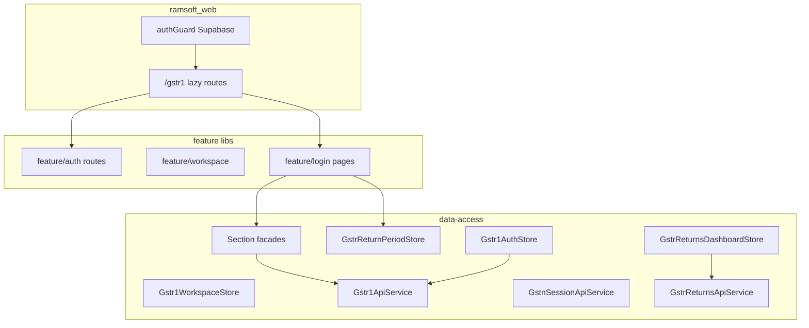
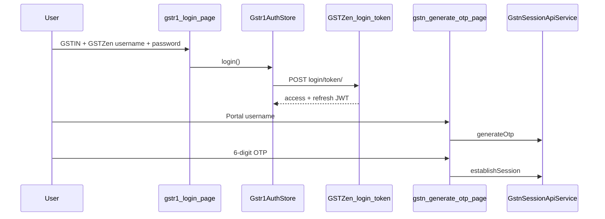
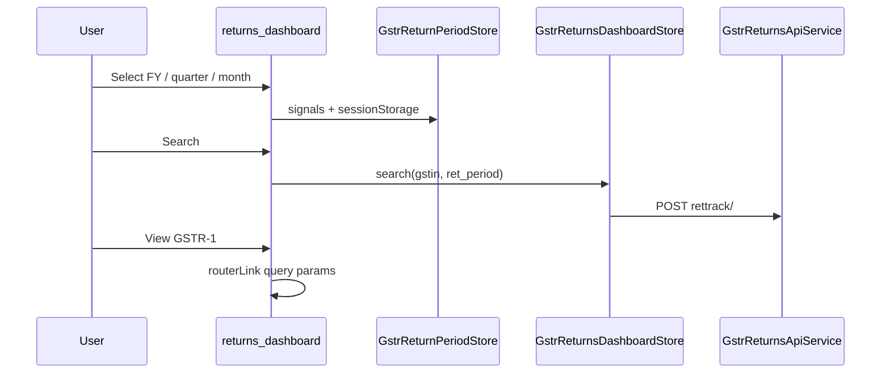
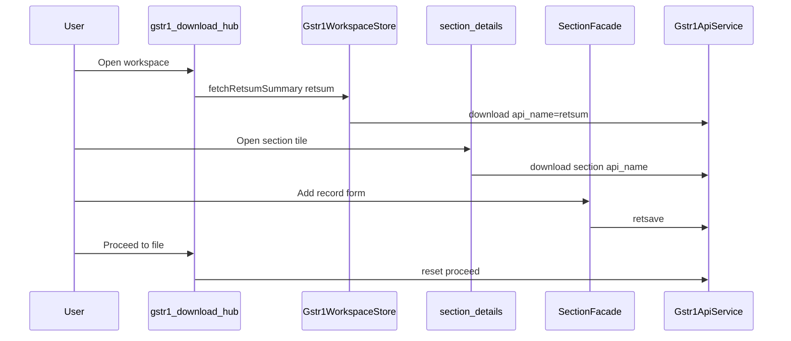

# GSTR-1 domain — developer guide

Enterprise documentation for the **GSTZen + GST portal** GSTR-1 flow in Ramsoft Builder. This README is the onboarding entry point; deeper references live under [`docs/`](docs/).

## Table of contents

1. [Architecture overview](#architecture-overview)
2. [Folder structure](#folder-structure)
3. [Three session layers](#three-session-layers)
4. [Initial authentication flow](#initial-authentication-flow)
5. [Return dashboard flow](#return-dashboard-flow)
6. [GSTR-1 filing flow](#gstr-1-filing-flow)
7. [Section catalog](#section-catalog)
8. [State management](#state-management)
9. [API and services](#api-and-services)
10. [Error handling](#error-handling)
11. [Environment and local dev](#environment-and-local-dev)
12. [Adding a new GSTR-1 section](#adding-a-new-gstr-1-section)
13. [Extending to GSTR-3B / GSTR-2B](#extending-to-gstr-3b--gstr-2b)
14. [Debugging](#debugging)

---

## Architecture overview



**Design rules**

| Layer | Responsibility |
| ----- | -------------- |
| **Pages** (`feature/login`) | Templates, forms, routing params, thin orchestration |
| **Stores / facades** (`data-access/gstr-returns`, `gstr1-filing`) | Signals, rettrack/RETSUM/retsave orchestration |
| **API services** (`data-access/gstzen-auth`) | HTTP only; no UI state |
| **Utils** (`utils/http-error`, mappers in feature) | Pure helpers |

See [docs/ARCHITECTURE.md](docs/ARCHITECTURE.md) for target vs. current layout.

---

## Folder structure

```
libs/gstr1/
├── models/jwt/                    # JWT types, readJwtExpiryUnixSec
├── utils/http-error/              # normalizeGstzenHttpError, gstzenUserFacingMessage
├── data-access/
│   ├── gstzen-auth/               # Auth store, interceptors, guards, API services
│   ├── gstr-returns/              # Return period store, rettrack dashboard store, FY utils
│   └── gstr1-filing/              # Workspace store, section facades, section models
├── feature/
│   ├── auth/                      # Route slice export (pages still under login)
│   ├── workspace/                 # Dashboard route export
│   ├── gstr1/                     # Filing constants export
│   └── login/                     # All page components + gstr1.routes.ts
└── docs/                          # ARCHITECTURE, API-REFERENCE, STATE-MANAGEMENT
```

**Import paths** (see `tsconfig.base.json`):

- `@ramsoft-builder/gstr1/data-access/gstzen-auth`
- `@ramsoft-builder/gstr1/data-access/gstr-returns`
- `@ramsoft-builder/gstr1/data-access/gstr1-filing`
- `@ramsoft-builder/gstr1/feature/login`
- `@ramsoft-builder/gstr1/utils/http-error`

---

## Three session layers

| Layer | Storage | Purpose |
| ----- | ------- | ------- |
| **Ramsoft** `AuthStore` | Supabase session | App login; profile GSTIN for dashboard |
| **GSTZen JWT** `Gstr1AuthStore` | `localStorage` `ramsoft.gstr1.auth.*` | Bearer token for all GSTZen APIs |
| **GST portal** | Server-side on GSTZen | Established via OTP; checked with `gstn-check-session` |

Portal session is **not** persisted in the browser. Filing APIs require both a valid JWT and an active portal session on the server.

---

## Initial authentication flow



| Step | Code |
| ---- | ---- |
| 1. User login (GSTZen) | [`gstr1-login.page.ts`](feature/login/src/lib/pages/gstr1-login.page.ts) → `Gstr1AuthStore.login()` |
| 2. Generate OTP | [`gstr1-gstn-generate-otp.page.ts`](feature/login/src/lib/pages/gstr1-gstn-generate-otp.page.ts) → `GstnSessionApiService.generateOtp()` |
| 3. Establish session | Same page → `establishSession({ gstin, otp })` |
| 4. Check session | [`gstr1-gstn-check-session.modal.ts`](feature/login/src/lib/pages/gstr1-gstn-check-session.modal.ts) |
| 5. Refresh session | [`Gstr1GstnSessionEnsureService`](data-access/gstzen-auth/src/lib/gstr1-gstn-session-ensure.service.ts) |
| 6. JWT expiry / 401 | [`gstr1UnauthorizedInterceptor`](data-access/gstzen-auth/src/lib/gstr1-unauthorized.interceptor.ts) → `/gstr1/login` |
| 7. GSTIN format | [`indian-gstin.validator.ts`](feature/login/src/lib/validators/indian-gstin.validator.ts) |
| 8. GSTIN linked to GSTZen user | `checkGstinSession` → `invalid_gstin` in [`gstn-check-session.models.ts`](data-access/gstzen-auth/src/lib/gstn-check-session.models.ts) |

Routes: [`routes/gstr1-auth.routes.ts`](feature/login/src/lib/routes/gstr1-auth.routes.ts) (exported via `@ramsoft-builder/gstr1/feature/auth`).

---

## Return dashboard flow



| Step | Detail |
| ---- | ------ |
| Route | `/gstr1/workspace/returns-dashboard` |
| Tax period | `ret_period` = `MMYYYY`; helpers in `GstrReturnPeriodStore` / [`indian-fy-return-period.ts`](data-access/gstr-returns/src/lib/indian-fy-return-period.ts) |
| Persistence | `sessionStorage` key `gstr1-returns-dashboard-filters-v2` |
| Search API | `GstrReturnsApiService.viewAndTrackReturns({ gstin, ret_period })` |
| Navigate to GSTR-1 | Query: `gstin`, `ret_period`, `api_name`, `filing_status`, `due_date` |

---

## GSTR-1 filing flow



| Step | Code |
| ---- | ---- |
| Download hub | [`gstr1-download-return.page.ts`](feature/login/src/lib/pages/gstr1-download-return.page.ts) |
| RETSUM | `Gstr1ApiService.downloadGstr1Return({ api_name: 'retsum' })` |
| Section table | [`gstr1-return-section-details.page.ts`](feature/login/src/lib/pages/gstr1-return-section-details.page.ts) |
| Save | `retsaveGstr1Return` via `Gstr1B2bFacade` / `Gstr1SectionRetsaveFacade` |
| Proceed | `resetGstr1Proceed` + optional zero-nil retsave |
| Status | [`gstr1-gstn-return-status.page.ts`](feature/login/src/lib/pages/gstr1-gstn-return-status.page.ts) |

**Retsave envelope** (all sections):

```json
{
  "fp": "042026",
  "gstin": "29XXXXX1234X1Z5",
  "gt": 0,
  "cur_gt": 0,
  "b2b": [ ]
}
```

`fp` is the return period (`MMYYYY`). Section key (`b2b`, `nil`, `txpd`, …) must match GSTZen, not always the download `api_name` (see TXP/TXPD below).

---

## Section catalog

| Portal | `api_name` | Download | Retsave key | Add page |
| ------ | ---------- | -------- | ----------- | -------- |
| B2B | `b2b` | Yes | `b2b` | `gstr1-b2b-add-record` |
| B2CL | `b2cl` | Yes | `b2cl` | `gstr1-b2cl-add-record` |
| B2CS | `b2cs` | Yes | `b2cs` | `gstr1-b2cs-add-record` |
| CDNR | `cdnr` | Yes | `cdnr` | `gstr1-cdnr-add-record` |
| CDNUR | `cdnur` | Yes | `cdnur` | `gstr1-cdnur-add-record` |
| EXP | `exp` | Yes | `exp` | `gstr1-exp-add-record` |
| AT | `at` | Yes | `at` | `gstr1-at-add-statewise` |
| ATADJ | `txp` | Yes | **`txpd`** | `gstr1-txpd-add-statewise` |
| NIL | `nil` | Yes | `nil` | `gstr1-nil-supplies` |
| HSN | `hsnsum` | Yes | `hsn` | `gstr1-hsn-summary-add` |
| DOCS | `doc_issue` | **No** | `doc_issue` | `gstr1-documents-issued` |
| ECO | `ecom` | Yes | `ecom` | `gstr1-eco-supplies` |
| SUPECOM | `supeco` | Yes | `supeco` | `gstr1-supplies-us-95` |

Amendment APIs: `b2ba`, `b2cla`, `cdnra`, `cdnura`, `expa`, `ata`, `txpa`, `ecoma`, `supecoa` — see [`gstr1-download-workspace.constants.ts`](feature/login/src/lib/constants/gstr1-download-workspace.constants.ts).

Per-section API details: [docs/API-REFERENCE.md](docs/API-REFERENCE.md).

---

## State management

| Store | File | Role |
| ----- | ---- | ---- |
| `Gstr1AuthStore` | `gstzen-auth` | JWT signals + login/logout |
| `GstrReturnPeriodStore` | `gstr-returns` | FY, quarter, `ret_period` |
| `GstrReturnsDashboardStore` | `gstr-returns` | Rettrack search |
| `Gstr1WorkspaceStore` | `gstr1-filing` | RETSUM hub |
| `Gstr1SectionDetailsFacade` | `gstr1-filing` | Section download + rows |
| `Gstr1B2bFacade` | `gstr1-filing` | B2B retsave (reference) |
| `Gstr1SectionRetsaveFacade` | `gstr1-filing` | Other section retsave |

Details: [docs/STATE-MANAGEMENT.md](docs/STATE-MANAGEMENT.md).

---

## API and services

| Service | Endpoints |
| ------- | --------- |
| `Gstr1GstzenAuthService` | `POST /accounts/api/login/token/` |
| `GstnSessionApiService` | `gstn-generate-otp`, `gstn-establish-session`, `gstn-check-session`, `gstn-refresh-session` |
| `GstrReturnsApiService` | `rettrack`, `retstatus` |
| `Gstr1ApiService` | `api/gstr1/download`, `retsave`, `reset` |
| `Gstr1aApiService` | `api/gstr1a/download`, `retsave` |

`Gstr1GstnOtpApiService` remains as a **deprecated facade** delegating to the services above.

All authenticated calls use `gstr1BearerInterceptor` with prefixes from `environment.gstr1.bearerUrlPrefixes`.

---

## Error handling

Use `@ramsoft-builder/gstr1/utils/http-error`:

```typescript
import { normalizeGstzenHttpError, gstzenUserFacingMessage } from '@ramsoft-builder/gstr1/utils/http-error';

catch (err) {
  const envelope = normalizeGstzenHttpError(err);
  const msg = gstzenUserFacingMessage(envelope.body) ?? envelope.message;
}
```

Download success: `isGstr1DownloadSuccessEnvelope()` in `gstr1-download-record.utils.ts`.

---

## Environment and local dev

```bash
npm run web:dev   # http://localhost:4200
```

1. Sign in to Ramsoft (shell `authGuard`).
2. Open `/gstr1/login` — GSTZen credentials.
3. `/gstr1/gstn/generate-otp` — portal OTP if filing APIs fail with session errors.
4. `/gstr1/workspace/returns-dashboard` — pick period and search.
5. **View** on GSTR-1 → download workspace.

Config: [`apps/ramsoft-web/src/environments/gstr1-environment.ts`](../apps/ramsoft-web/src/environments/gstr1-environment.ts). Dev uses `/gstzen-proxy/**` (see `apps/ramsoft-web/src/server.ts`).

Register in `app.config.ts`:

- `provideGstr1GstzenAuthConfig(environment.gstr1)`
- `gstr1BearerInterceptor`, `gstr1UnauthorizedInterceptor`

---

## Adding a new GSTR-1 section

1. Add tile in `GSTR1_SUMMARY_SECTION_TITLES` / `GSTR1_SECTION_CARD_PRIMARY_API`.
2. If GSTZen supports download, add to `GSTR1_DOWNLOAD_API_NAMES` in `gstr1-download.models.ts`.
3. Add route under `gstr1-download/section/:apiName/...` in `gstr1.routes.ts`.
4. Extend `gstr1-section-detail-rows.mapper.ts` and `uiKindForDownloadApi()`.
5. Create add page; use `Gstr1SectionRetsaveFacade` + `submitGstr1SectionRetsave()`.
6. Document request/response in `docs/API-REFERENCE.md`.

---

## Extending to GSTR-3B / GSTR-2B

Mirror the pattern:

- `Gstr2ApiService` / `Gstr3bApiService` (already in `gstzen-auth`)
- Return-specific stores under `libs/gstr3b/data-access/...` (future)
- Feature slice `feature/gstr3b` with routes only in `feature/login` today

---

## Debugging

| Symptom | Check |
| ------- | ----- |
| 401 on API | JWT expiry; `Gstr1AuthStore.hasValidToken()` |
| Session errors on download | Portal OTP flow; `gstn-check-session` |
| Empty RETSUM tiles | `api_name: 'retsum'` response `message.retsum` |
| Wrong period | Query `ret_period` vs dashboard `GstrReturnPeriodStore` |

Network tab: filter `/gstzen-proxy` (dev) or `my.gstzen.in` (prod).

---

## Further reading

- [docs/ARCHITECTURE.md](docs/ARCHITECTURE.md)
- [docs/API-REFERENCE.md](docs/API-REFERENCE.md)
- [docs/STATE-MANAGEMENT.md](docs/STATE-MANAGEMENT.md)
- GSTZen JWT API: https://my.gstzen.in/docs/api/jwt-authentication-api/
