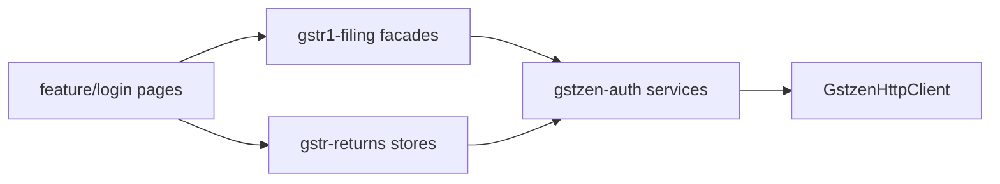

# GSTR domain architecture

## Layering



**Dependency rule:** `feature/*` → `data-access/*` → `utils/*` / `models/*`. Never import pages from data-access (section model lives in `gstr1-filing`).

## Feature slices

| Slice | Export path | Contents today |
| ----- | ----------- | -------------- |
| Auth | `@ramsoft-builder/gstr1/feature/auth` | `gstr1AuthRoutes` |
| Workspace | `@ramsoft-builder/gstr1/feature/workspace` | `returnsDashboardRoute` |
| GSTR-1 filing | `@ramsoft-builder/gstr1/feature/gstr1` | Section constants |
| Login (legacy bucket) | `@ramsoft-builder/gstr1/feature/login` | All page components |

Pages will move from `feature/login` into slice libraries incrementally; routes are already split in `routes/gstr1-auth.routes.ts`.

## Communication: store ↔ service

1. **Store** holds UI state (signals).
2. **Service** performs HTTP POST via `GstzenHttpClient`.
3. **Interceptor** attaches JWT; **guard** blocks routes without token.
4. **Facade** combines validation + `buildRetsavePayload()` registration + `submit()`.

Example (B2B — reference implementation):

```typescript
readonly facade = inject(Gstr1B2bFacade);

async save(): Promise<void> {
  this.facade.setContext(gstin, retPeriod, isGstr1a);
  this.facade.registerPayloadBuilder(() => this.buildRetsavePayload());
  await this.facade.submit();
}
```

## Portal session facade

`GstnPortalSessionFacade.ensureBeforeFiling(gstin)` wraps check-then-refresh. Not invoked automatically before every download yet; call from hub or a global guard when product requires it.

## Extension: GSTR-3B

1. Add `libs/gstr3b/data-access/` with `Gstr3bWorkspaceStore` + `Gstr3bApiService` (delegate existing `Gstr3bApiService` in gstzen-auth or move).
2. Add `feature/gstr3b` routes; keep pages under `feature/login` until moved.
3. Reuse `GstrReturnPeriodStore` for `ret_period`.

Same pattern applies to GSTR-2B (`Gstr2ApiService.fetchGstr22b`).
