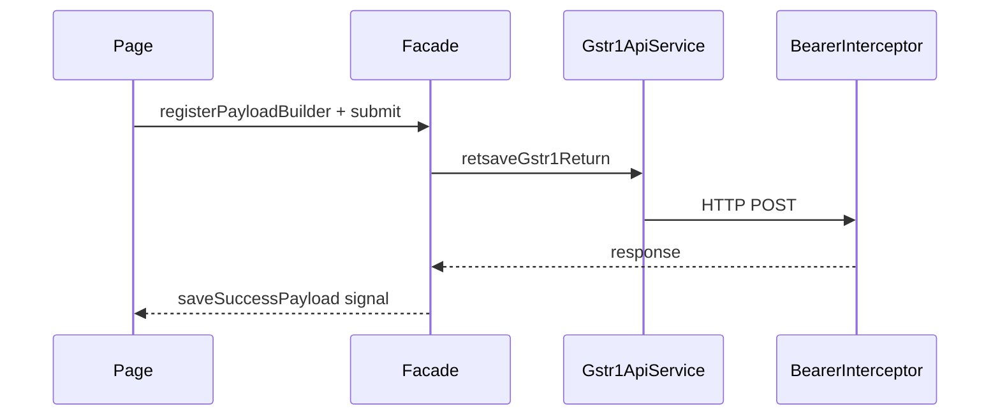

# State management — GSTR-1

Angular **signals** are the standard. No NgRx store exists in this domain.

## Global (providedIn: 'root')

### Gstr1AuthStore

| Signal | Meaning |
| ------ | ------- |
| `status` | `idle` \| `loading` \| `authenticated` \| `error` |
| `accessToken` | Bearer JWT |
| `expiresAtMs` | From JWT `exp` or 24h fallback |
| `authResolved` | Hydration complete |

Persisted via `Gstr1TokenStorageService` → `localStorage`.

### GstrReturnPeriodStore

| Signal | Meaning |
| ------ | ------- |
| `selectedFyStart` | Indian FY start year |
| `selectedQuarter` | `q1`–`q4` |
| `selectedRetPeriod` | `MMYYYY` |
| `periodOptions` | Months in selected quarter |

**Persistence:** `sessionStorage` `gstr1-returns-dashboard-filters-v2` (written in store `effect`).

### GstrReturnsDashboardStore

| Signal | Meaning |
| ------ | ------- |
| `loading` | Rettrack in flight |
| `payloadOk` | Last search valid |
| `rawPayload` | Full rettrack JSON |
| `filedRows` | Parsed rows for cards |

### Gstr1WorkspaceStore

| Signal | Meaning |
| ------ | ------- |
| `retsumSecSum` | RETSUM section rows |
| `retsumTileCounts` | Portal tile counts |
| `fetchState` | RETSUM load state |

## Component-scoped

Use `providers: [Gstr1SectionRetsaveFacade]` on add-record pages when isolating retsave state.

### Gstr1B2bFacade (root)

Reference for B2B; registers `buildRetsavePayload` before `submit()`.

### Gstr1SectionDetailsFacade

Download + `apiRows`; page maps API data to `Gstr1SectionDetailRow` via feature mappers.

## Cross-page period context

| Mechanism | When |
| --------- | ---- |
| Query params | `gstr1-download?gstin=&ret_period=` |
| Route params | `section/:apiName/:gstin/:retPeriod` |
| Session storage | Dashboard filters only |

There is **no** global period store consumed by all pages yet; pass query/params or read `GstrReturnPeriodStore` where injected.

## Local drafts (sessionStorage)

| Section | Key helper |
| ------- | ---------- |
| Documents | `docIssueStorageKey()` |
| ECO | `ecoSuppliesStorageKey()` |
| SUPECOM | `us95DraftsStorageKey()` |

## Data flow diagram

