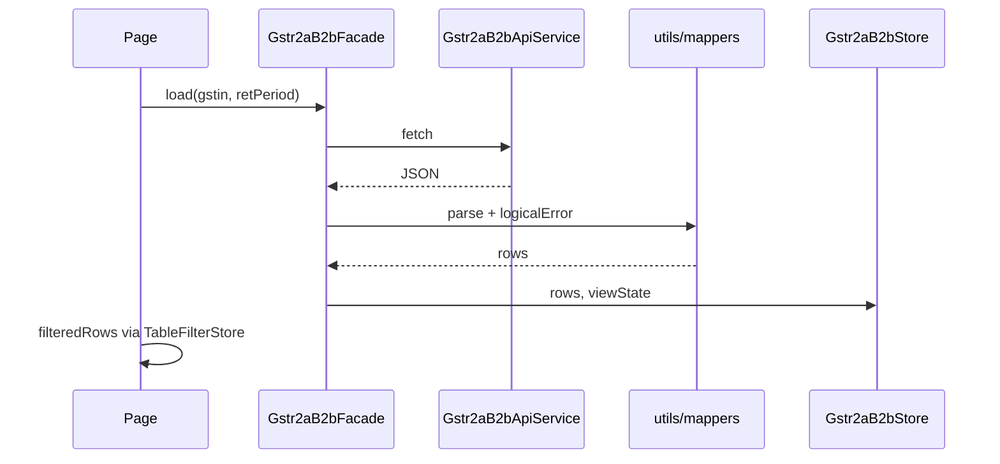

# State management

Angular **signals** only (no NgRx).

## Global stores (`providedIn: 'root'`)

| Store | Signals | Persistence |
| ----- | ------- | ----------- |
| `Gstr2aReturnPeriodStore` | `gstin`, `retPeriod` (via GSTR-1 period store), FY labels | GSTR-1 `sessionStorage` for FY/quarter |
| `Gstr2aTableFilterStore` | `searchQuery`, `columnVisibility` | Memory |
| `Gstr2aPaginationStore` | `page`, `pageSize`, `total` | Memory |

## Section store base

`Gstr2aSectionStoreBase<TRow>`:

- `viewState`: `idle | loading | success | empty | error`
- `gstin`, `retPeriod`, `filingLabel`
- `rows`, `httpError`, `logicalError`

## Facade base

`Gstr2aSectionFacadeBase` implements `load()`:

1. `setContext` / `paramsValid`
2. `fetchPayload` (subclass → API service)
3. `logicalError` + `mapPayload`
4. Update store signals

## B2B data flow

