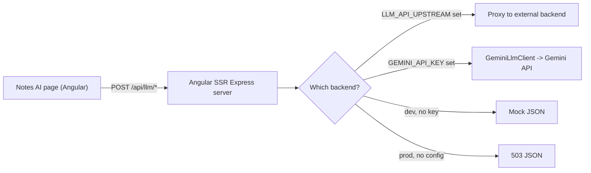

# LLM Notes AI — Integration & Setup Guide

AI-powered note generation for the Angular app: turn **text**, a **YouTube/media URL**, or an uploaded **audio/video** file into clean notes/summaries.

The model provider is **Google's Gemini API** (Generative Language API, the Google AI Studio flavor). NotebookLM is **not** used. This guide documents the whole feature end-to-end so it can be reused in other projects.

---

## 1. What it does



The browser always calls same-origin `/api/llm/*`. The server decides what actually fulfills the request (see [Backend selection](#5-backend-selection-priority)).

---

## 2. Project structure

| Path | Type | Responsibility |
|------|------|----------------|
| [`libs/llm/models/api`](models/api) | JS lib | Shared types: `LlmLanguage`, `LLM_LANGUAGES`, `LlmTextResponse`, `GenerateTextPayload`, `UrlToTextPayload` |
| [`libs/llm/data-access/api`](data-access/api) | JS lib | `LlmService` (Angular `HttpClient`), `LLM_API_CONFIG` token, `LlmApiError` — **frontend** |
| [`libs/llm/data-access/gemini`](data-access/gemini) | JS lib | `GeminiLlmClient` — **server-side** Gemini calls (text, YouTube URL, media via Files API) |
| [`libs/llm/feature/tools`](feature/tools) | Angular lib | Notes AI page, placeholder pages, routes, file/url helpers |
| `apps/ramsoft-web/src/llm-api.handlers.ts` | App | Express handlers for `/api/llm/*` + backend selection + `.env` loader |
| `apps/ramsoft-web/src/server.ts` | App | Calls `registerLlmApiHandlers(app)` before the SSR fallback |
| `apps/ramsoft-web/src/environments/*` | App | `llm` URL config wired via `LLM_API_CONFIG` in `app.config.ts` |

Import aliases (in `tsconfig.base.json`):

```
@ramsoft-builder/llm/models/api
@ramsoft-builder/llm/data-access/api
@ramsoft-builder/llm/data-access/gemini
@ramsoft-builder/llm/feature/tools
```

---

## 3. Prerequisites

- A **Google Gemini API key** from Google AI Studio: https://aistudio.google.com/apikey
  (AI Studio keys are pre-enabled and unrestricted — simplest option.)
- Node 18+ (uses global `fetch`, `FormData`, `Blob`).

---

## 4. Setup (this project)

1. **Create `.env`** in the repo root (gitignored):

   ```bash
   cp .env.example .env
   ```

   Then fill in:

   ```ini
   GEMINI_API_KEY=your_key_here
   GEMINI_MODEL=gemini-2.5-flash
   ```

2. **Run the dev server** (auto-loads `.env`):

   ```bash
   npm run web:dev
   ```

3. Open http://localhost:4200/notes-ai/create, paste a YouTube link (or upload audio/video, or type text), pick a language, and click **Generate Text**.

That's it — no key inlining needed. `loadLocalEnvFiles()` in `llm-api.handlers.ts` reads `.env`/`.env.local` at startup without overriding real environment variables.

---

## 5. Backend selection (priority)

`registerLlmApiHandlers()` chooses the backend in this order:

| # | Condition | Behavior |
|---|-----------|----------|
| 1 | `LLM_API_UPSTREAM` set | Proxy every `/api/llm/*` request to that host |
| 2 | `GEMINI_API_KEY` set | Use Gemini directly via `GeminiLlmClient` |
| 3 | `NODE_ENV !== 'production'` or `LLM_API_MOCK=true` | Return mock JSON (dev) |
| 4 | otherwise | Return `503` JSON |

Environment variables:

| Var | Required | Default | Purpose |
|-----|----------|---------|---------|
| `GEMINI_API_KEY` | for Gemini | — | Google AI Studio key |
| `GEMINI_MODEL` | no | `gemini-2.5-flash` | Gemini model id |
| `LLM_API_UPSTREAM` | no | — | Proxy to an external backend instead of Gemini |
| `LLM_API_MOCK` | no | — | Force mock responses (`true`) |

---

## 6. API contract

All endpoints are same-origin under `/api/llm` and return:

```json
{ "success": true, "text": "generated notes…" }
```

On error: `{ "success": false, "message": "reason" }` with a 4xx/5xx status.

| Endpoint | Method | Body | Notes |
|----------|--------|------|-------|
| `/api/llm/generate-text` | POST | JSON `{ text, language, title? }` | Notes from raw text |
| `/api/llm/url-to-text` | POST | JSON `{ url, language, source? }` | `source` = `video` \| `audio` (default `video`); YouTube supported |
| `/api/llm/audio-to-text` | POST | `multipart/form-data`: `file`, `language` | Audio upload (Gemini Files API) |
| `/api/llm/video-to-text` | POST | `multipart/form-data`: `file`, `language` | Video upload (Gemini Files API) |

Supported `language` values: `English`, `Telugu`, `Hindi`, `Tamil`, `Kannada` (see `LLM_LANGUAGES`).

---

## 7. Frontend usage

Routes (lazy, under the authenticated shell in `app.routes.ts`):

```
/notes-ai/create        -> full Notes AI page
/audio-to-text/create   -> placeholder
/video-to-text/create   -> placeholder
/summarizer/create      -> placeholder
/translate/create       -> placeholder
```

`LlmService` ([`data-access/api`](data-access/api)) methods:

```ts
uploadAudio(file: File, language: LlmLanguage): Observable<LlmTextResponse>
uploadVideo(file: File, language: LlmLanguage): Observable<LlmTextResponse>
generateText(payload: GenerateTextPayload): Observable<LlmTextResponse>
extractFromUrl(payload: UrlToTextPayload): Observable<LlmTextResponse>
```

It posts to the URLs provided by `LLM_API_CONFIG` (set in `app.config.ts` from `environment.llm`) and maps HTTP/HTML/parse failures to a friendly `LlmApiError`.

---

## 8. The Gemini client (server-side)

[`GeminiLlmClient`](data-access/gemini/src/lib/gemini-llm.client.ts):

- `generateNotesFromText(text, language, title?)` — single `generateContent` call.
- `summarizeYoutubeUrl(url, language, kind)` — passes the URL as a `fileData.fileUri` part (no download needed).
- `summarizeMedia(bytes, mimeType, language, kind)` — uploads via the **Files API** (resumable upload → poll until `ACTIVE` → `generateContent`), so large files work.

Endpoint used: `https://generativelanguage.googleapis.com/v1beta/models/{model}:generateContent?key=...`

---

## 9. Production / deployment

- Set `GEMINI_API_KEY` (and optionally `GEMINI_MODEL`) as real environment variables on the host — `.env` is for local dev.
- Or set `LLM_API_UPSTREAM` to point at a dedicated backend service and keep keys off the web server entirely.
- The handlers must be registered **before** the Angular SSR catch-all so `/api/llm/*` returns JSON, not `index.html`.

---

## 10. Porting to another project

For another **Nx + Angular SSR** project:

1. Copy the four libs: `libs/llm/{models/api, data-access/api, data-access/gemini, feature/tools}` and add their path aliases to `tsconfig.base.json`.
2. Copy `apps/<app>/src/llm-api.handlers.ts` and call `registerLlmApiHandlers(app)` in `server.ts` (before the SSR fallback).
3. Add `multer` (`pnpm add multer`, `pnpm add -D @types/multer`) for multipart parsing.
4. Add the `llm` block to your environments and provide `LLM_API_CONFIG` in `app.config.ts`.
5. Register the routes in `app.routes.ts` and add the Notes AI cards/links to your home page.
6. Add `.env` (+ `.gitignore` entry) with `GEMINI_API_KEY`.

For a **non-Angular / plain backend** project, you only need `GeminiLlmClient` (or its logic) plus an Express/any server exposing the four endpoints with the contract in section 6.

---

## 11. Troubleshooting

| Symptom | Cause | Fix |
|---------|-------|-----|
| `Unexpected token '<', "<!DOCTYPE"...` | `/api/llm/*` hit the SPA fallback (no handler) | Ensure `registerLlmApiHandlers(app)` runs before the SSR catch-all; restart server |
| Response is the "Mock … transcript" text | No `GEMINI_API_KEY` in the server env | Add it to `.env` and restart `npm run web:dev` |
| `403 SERVICE_DISABLED` | Gemini API not enabled on the key's GCP project | Enable "Generative Language API" for that project, or use an AI Studio key |
| `403 API_KEY_SERVICE_BLOCKED` | Key restricted to other APIs | In GCP Credentials, allow "Generative Language API" or "Don't restrict key" |
| `503 LLM API is not configured` | Production with no key/upstream | Set `GEMINI_API_KEY` or `LLM_API_UPSTREAM` |
| YouTube URL fails | Private/region-locked video, or preview limits | Use a public video; YouTube URL support is in preview |

Quick key test:

```bash
curl -s -w "\nHTTP %{http_code}\n" \
  -X POST "https://generativelanguage.googleapis.com/v1beta/models/gemini-2.5-flash:generateContent?key=$GEMINI_API_KEY" \
  -H "Content-Type: application/json" \
  -d '{"contents":[{"role":"user","parts":[{"text":"Reply with OK"}]}]}'
```

---

## 12. Security

- **Never commit keys.** `.env` and `.env.local` are gitignored; `.env.example` holds placeholders only.
- Treat any key shared in chat/logs as compromised — **rotate it** in AI Studio and update `.env`.
- Prefer host environment variables (or `LLM_API_UPSTREAM`) in production over a `.env` file.
